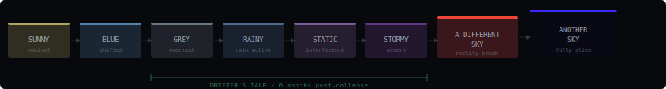
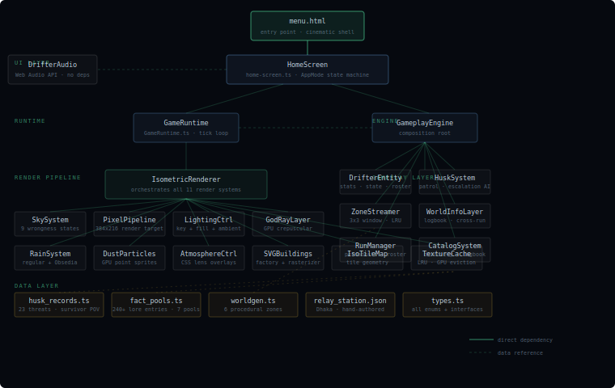

# DRIFTER'S TALE

> *Six months after the collapse. The sky is wrong. You are already inside it.*

A procedural investigation-survival RPG set in the **Cygnus Signal Series** universe. HD-2D isometric rendering, TypeScript + Three.js, no engine — built from scratch.

---

```
 ░░░░░░░░░░░░░░░░░░░░░░░░░░░░░░░░░░░░░░░░░░░░░░░░░░░░░░░░░░░░░░░░░░░░░░░░
 ░  WNCORE RELAY · SIGNAL ACTIVE · NODE ID 07-DHK · STATUS: LIVE         ░
 ░░░░░░░░░░░░░░░░░░░░░░░░░░░░░░░░░░░░░░░░░░░░░░░░░░░░░░░░░░░░░░░░░░░░░░░░
```

---

## What This Is

Each run generates a Drifter from the faction logbook, drops them into a procedurally-built zone, and asks one question: **can you extract before the signal drops?**

The world is 6 months post-collapse. The sky is not right. Different zones carry different wrongness states — Finland reads grey and familiar, Nepal's sky is fully red. The further in you go, the less the atmosphere resembles something that should exist.

You are not the protagonist of *Another Sky*. You are a Drifter. One of many. The logbook gets longer whether you survive or not.

---

## Sky State Progression

The sky is the primary visual language for reality-break. It follows a discrete named-state system — not a gradient.

<!--
SVG: Sky wrongness state progression bar
-->
<p align="center">

</p>

> **Obsedia Rain** (Black Rain / Moon Rain / Starfall) is a separate named hazard state that overrides the sky — a constant black oil-like rain that makes the sky visually bleed downward. Treated as its own system, not a weather effect.

---

## Architecture

<!--
SVG: System architecture diagram
-->
<p align="center">

</p>

---

## Tech Stack

| Layer | Tech |
|---|---|
| Language | TypeScript 5.3 |
| 3D engine | Three.js r160 |
| Build | `tsc` → static dist |
| Deploy | Vercel (static build) |
| Backend | None — fully browser |
| Audio | Web Audio API (procedural, zero files) |
| Persistence | `localStorage` |

---

## Project Structure

```
drifter-s-tale/
├── menu.html                  # Cinematic entry point — opens without build step
├── index.html                 # Direct play entry
├── package.json
├── tsconfig.json
├── vercel.json
│
├── src/
│   ├── types.ts               # All enums + interfaces (WeatherType, WrongnessState, Zone…)
│   ├── worldgen.ts            # Procedural zone generator — 6 zones, seeded RNG
│   ├── utils.ts               # RNG, ID gen, noise helpers
│   ├── index.ts               # Public exports
│   │
│   ├── render/
│   │   ├── SkySystem.ts       # 9 wrongness states, Moon, Obsedia Rain, day/night cycle
│   │   ├── PixelPipeline.ts   # 384×216 internal render → upscale
│   │   ├── IsometricRenderer.ts   # Orchestrates all render systems
│   │   ├── LightingController.ts  # Key light, fill light, ambient
│   │   ├── GodRayLayer.ts         # GPU crepuscular rays (GPU Gems approach, 48 samples)
│   │   ├── RainSystem.ts          # GPU point-sprite rain + Obsedia black rain + splashes
│   │   ├── DustParticles.ts       # Ambient scatter — suppressed during rain
│   │   ├── AtmosphereController.ts  # CSS lens overlays (vignette, scanlines, wet lens)
│   │   ├── IsoTileMap.ts          # Isometric tile geometry
│   │   ├── SVGBuildingFactory.ts  # Procedural SVG building generation
│   │   ├── SVGRasterizer.ts       # SVG → Three.js texture
│   │   ├── SpriteAnimator.ts      # 8-direction Drifter sprite
│   │   └── TextureCache.ts        # LRU cache, GPU eviction on zone unload
│   │
│   ├── gameplay/
│   │   ├── GameplayEngine.ts      # Composition root — wires all gameplay systems
│   │   ├── DrifterEntity.ts       # Player entity — stats, state, roster slot
│   │   ├── DrifterRoster.ts       # Roster persistence — permadeath-aware
│   │   ├── MovementController.ts  # WASD + virtual joystick input → movement
│   │   ├── HuskSystem.ts          # Patrol + escalation AI, per-zone population
│   │   ├── ThreatModel.ts         # Detection radius — sight/sound/vibration per type
│   │   ├── InteractionSystem.ts   # E-key proximity interact
│   │   ├── CatalogSystem.ts       # Discovery logbook — pulls from fact_pools + husk_records
│   │   ├── InventorySystem.ts     # Items, consumables, currency origin
│   │   ├── WorldInfoLayer.ts      # Cross-run logbook — localStorage-backed
│   │   ├── RunManager.ts          # Permadeath, roster persistence, run lifecycle
│   │   └── ZoneStreamer.ts        # 3×3 zone window, load/unload with onLoad/onUnload callbacks
│   │
│   ├── data/
│   │   ├── husk_records.ts        # 23 threat types (9 Husks, 5 Infected, 1 Ghuul) — survivor POV only
│   │   ├── fact_pools.ts          # 240+ discoverable lore entries, 7 pools
│   │   └── relay_station.json     # WNCORE Relay Station 7, Dhaka — hand-authored zone
│   │
│   └── ui/
│       ├── home-screen.ts         # Full AppMode state machine — menu, briefing, play, settings
│       └── GameRuntime.ts         # Three.js tick loop, input, world map, mobile touch controls
│
└── assets/
    ├── characters/            # Drifter sprites (8-direction)
    ├── tiles/                 # Isometric tile sheets
    ├── buildings/             # Building reference art
    ├── audio/                 # Placeholder folders (sfx, music, voice)
    │   ├── music/ambient/
    │   ├── music/tension/
    │   ├── music/extraction/
    │   ├── sfx/footsteps/
    │   ├── sfx/hazard/
    │   ├── sfx/radio/
    │   └── sfx/ui/
    └── ui/
```

---

## Getting Started

**Requires:** Node.js 18+, a GitHub Codespace or any terminal.

```bash
# Install
npm install

# Type check (no emit)
npm run type-check

# Build to dist/
npm run build

# Watch mode
npm run dev
```

Open `menu.html` directly in a browser for the cinematic shell with no build step.

Deploy: push to GitHub, connect to Vercel. The `vercel.json` + `package.json` `vercel-build` script handles everything.

---

## Gameplay Loop

```
ROSTER DRAW → ZONE GEN → PRE-RUN BRIEF → DEPLOY → EXPLORE → EXTRACT
     ↑                                                           |
     └────────────── permadeath · new drifter next run ─────────┘
```

1. **Roster draw** — a Drifter is pulled from the procedural faction logbook. Name, signal strength, known region.
2. **Zone generation** — deterministic seeded worldgen builds the zone. Wrongness state assigned per zone, not globally.
3. **Pre-run brief** — sky state, threat count, field intel lines. Survivor voice, no mechanical spoilers.
4. **Explore** — WASD/virtual joystick. `E` to interact and catalog. `M` for survey map.
5. **Extract** — reach the extraction point before signal drops. The logbook entry is written either way.

---

## Lore Notes for Contributors

- **The mechanism behind Husks is an end-game spoiler.** All player-facing text must use survivor-POV behavioral observation only. No references to psychological rejection of reality, veil failure, or the actual cause. Observable traits only — how they move, what they respond to, what survivors have noted.
- **The Moon is a plot anchor.** It has phase, position, and anomaly state (`Moon Dome`, `Moon Dwellers`, shining anomalies). Treat it as a persistent trackable element, not ambient lighting.
- **Wrongness is zone-specific, not global.** Different zones carry different states simultaneously. Severity follows an intentional zone progression curve — do not randomize freely.
- **Obsedia Rain is its own named state.** Not a weather effect. Not a visual filter. Its own system entry.
- **6 months post-collapse** — the sky range in DRIFTER is GREY through STORMY. Not the full Sunny→Another Sky range. Zone progression: Finland first (grounded), Nepal last (severe, outbreak origin, red sky).

---

## Universe

DRIFTER'S TALE is part of the **Cygnus Signal Series** — an original post-apocalyptic fiction universe built around two texts:

- *Another Sky* (novel, 2032 in-universe) — Som's POV. The reader's POV throughout.
- *Simulunas* (short story, 2048 in-universe)

The public ARG layer lives at [wncore-radio.vercel.app](https://wncore-radio.vercel.app) — a radio aggregator platform with layered horror exposure. The deeper archive is at [siharu.vercel.app](https://siharu.vercel.app).

---

```
 > RELAY NODE 07-DHK · SIGNAL HOLDING
 > DRIFTER DEPLOYED
 > LOGBOOK OPEN
 > _
```
